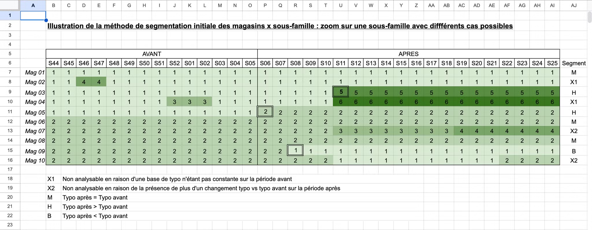

# Kata TDD

Le développement dirigé par les tests consiste à écrire des tests avant le code de production. L'objectif est de définir le comportement attendu d'une fonctionnalité avant de l'implémenter.

Les trois règles principales du TDD sont :

1. **On doit écrire un test qui échoue** avant d’écrire n’importe quel code de production.
2. **On ne doit pas écrire plus de tests** que ce qui est nécessaire pour échouer ou ne pas compiler.
3. **On ne doit écrire que le code suffisant** pour que le test actuellement en échec réussisse.

Le développement est divisé en trois étapes :

- `Étape rouge` : Le test échoue.
- `Étape verte` : Le code passe le test.
- `Étape refacto` : Optimisation du code sans changer son comportement.

## Installation

```bash
# Mettre à jour et configurer pyenv
brew update && brew upgrade pyenv
pyenv install 3.12.6

# Créer un environnement virtuel pour le kata
pyenv virtualenv 3.12.6 kata_tdd

# Cloner le dépôt et configurer l'environnement local
git clone https://github.com/louis-marx/kata-tdd.git
cd kata-tdd/
pyenv local kata_tdd

# Installer les dépendances avec Poetry
poetry install
```

## Contexte du Kata

Ce kata est basé sur un cas réel tiré d'une analyse réalisée pour Carrefour. Votre mission est de mener la première étape de cette analyse :

1. **Segmentation des couples magasins, sous-famille**

Le client vous présente la logique de segmentation en vous fournissant un fichier Excel qu'il a conçu :



Une fois l'environnement configuré, essayez d'implémenter la logique de la [segmentation initiale](./src/main.py) en suivant l'approche TDD.

Pour vérifier que votre implémentation fonctionne, lancez [les tests](./tests/test_main.py) avec la commande suivante :

```bash
poetry run pytest
```